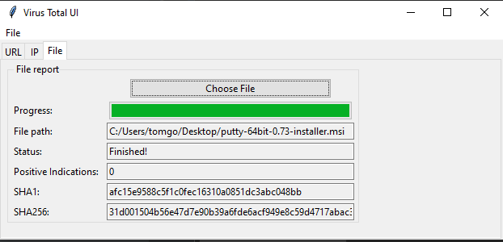

# Antivirus software (Total virus)
#### Study Python & Cyber Security by implementing Virus Total functions in a tkinter UI!

This project includes:
- REST API's
- Basic security analysis concepts
- UI programming with python & tkinter
- The difference between sync & async operations
- Python classes
- GIT branches, and the proper way to build your features using them
